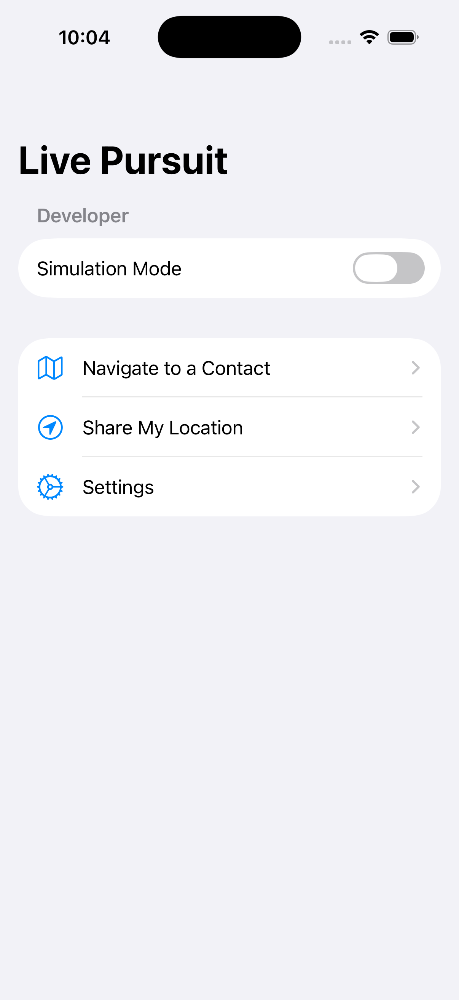
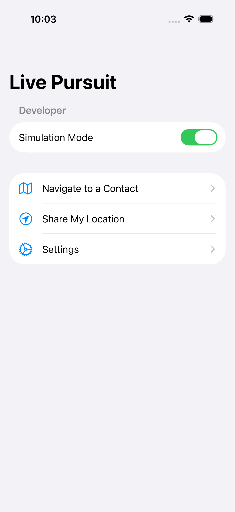
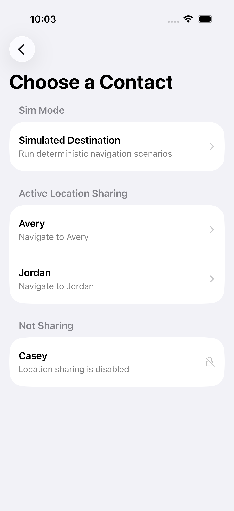
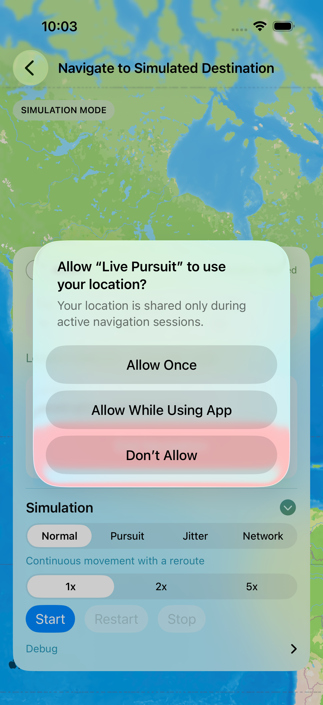
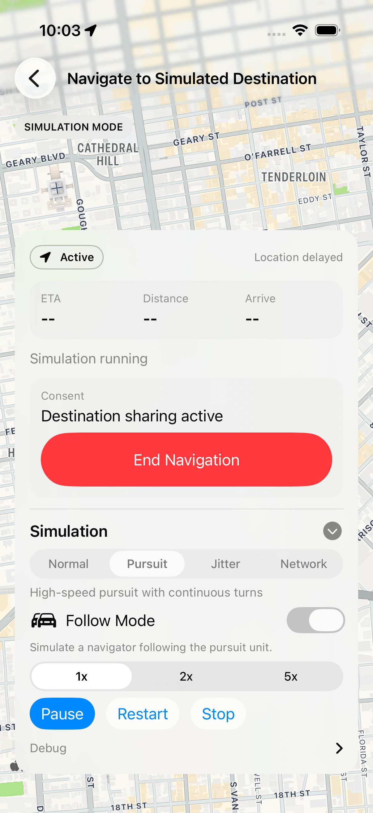
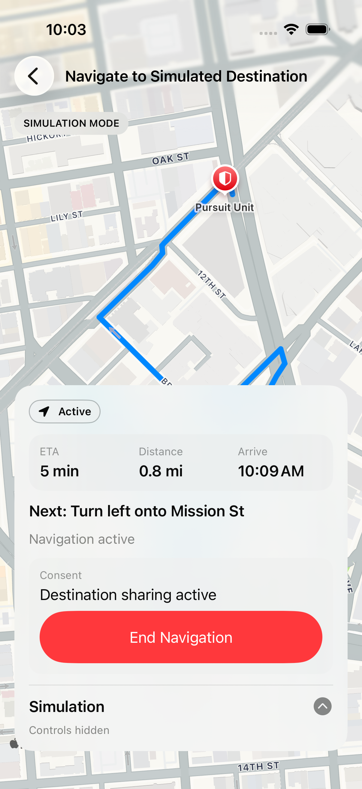
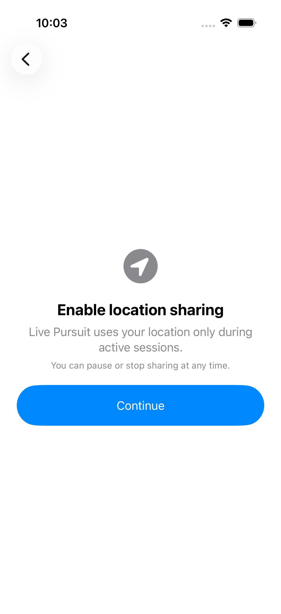
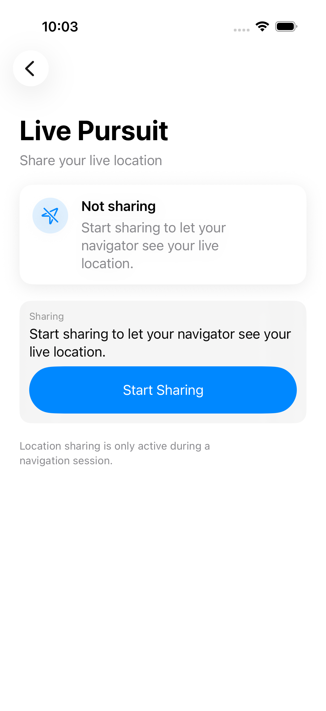
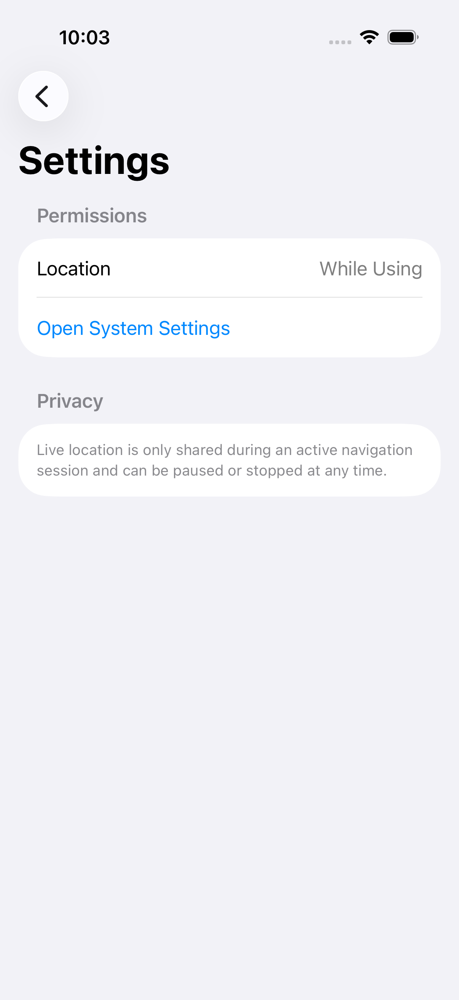

# Live Pursuit PRD

Project: Live Destination Navigation  
Product: Live Pursuit  
Platform: iOS MVP  
Status: Draft for stakeholder review  
Last updated: May 9, 2026  
Source docs: `docs/prd.md`, `docs/phase_status.md`, `docs/prd_screenshots/README.md`

## 1. Executive Summary

Live Pursuit lets one iOS user navigate to another trusted user whose location is moving in real time. Standard navigation assumes a static destination, which causes stale routes, inaccurate ETAs, and manual restarts when the destination is a person in motion.

The MVP provides a consent-first iOS experience backed by a Node service that owns session state, destination location relay, reroute decisions, throttling, simulation scripts, and telemetry. The product should validate whether live destination navigation can feel stable, understandable, and safe enough for real-world 1:1 meetups.

### Success Criteria

- Navigator can start navigation to a shared contact.
- Destination movement updates the target location without manual restart.
- Route and ETA update after backend-approved reroute decisions.
- Destination consent is visible and revocable.
- App remains usable during delayed location or network conditions.
- Battery usage is acceptable for 30 to 60 minute sessions.

## 2. Problem Definition

### Customer Problem

People often coordinate meetups while both parties are moving. Existing navigation tools route to static pins, so the navigator must repeatedly ask for updated location, restart navigation, or follow stale directions.

### Target Users

- iOS users coordinating real-time meetups.
- Trusted contacts with active location sharing.
- Users who need live navigation to a person rather than a place.

### User Roles

- Navigator: starts navigation to a shared contact, sees map, route, ETA, and reroute status.
- Destination: shares live location, sees active sharing status, and can pause or stop sharing.

## 3. Solution Overview

Live Pursuit treats a trusted contact as a live destination. The iOS client renders the route and controls; the backend manages navigation sessions, consent, location updates, reroute thresholds, cooldowns, and simulation tooling.

### MVP Scope

- iOS SwiftUI app.
- 1:1 navigation only.
- Trusted contacts only.
- Backend-owned reroute decisions.
- Explicit consent and sharing controls.
- Simulated destination scenarios for QA and demos.
- Basic telemetry for session, simulation, and reroute events.

### Out of Scope

- Group navigation.
- Chat or messaging.
- Anonymous discovery.
- Android or web client.
- Passive background tracking outside active sessions.
- Monetization.
- Predictive meeting points.

## 4. Key Screens

### 4.1 Home

The home screen provides the primary entry points: navigate to a contact, share location, and open settings.



Requirements:

- Show app-level navigation options within one tap.
- Keep the default screen minimal and understandable.
- In debug builds, expose Simulation Mode for deterministic QA.

### 4.2 Home With Simulation Mode

Simulation Mode enables deterministic navigation scenarios for QA, demos, and product review.



Requirements:

- Simulation Mode must only be exposed in debug builds.
- Enabling Simulation Mode should reveal simulated contacts and route scenarios.
- State should persist during a QA run.

### 4.3 Contact Selection

The contact list separates actively sharing contacts from contacts who are not sharing.



Requirements:

- Active sharing contacts are selectable for navigation.
- Not-sharing contacts are visible but not actionable.
- Simulated destination appears only when Simulation Mode is enabled.
- Contact rows must support 44 pt minimum touch targets.

### 4.4 Navigation Ready State

The navigation view shows the map, destination state, ETA summary, consent state, and simulation controls.



Requirements:

- Show route/map context immediately after navigation starts.
- Display session and consent state in the bottom overlay.
- Keep simulation controls accessible without obscuring the map.
- Show clear status text while waiting for destination updates.

### 4.5 Navigation Running State

The running state shows an active pursuit simulation and exposes pause, restart, stop, speed, and debug information.



Requirements:

- Starting a simulation should update the primary action to Pause.
- Reroute and cooldown state should be inspectable in debug controls.
- ETA and distance summary should remain visible during simulation.
- Location permission prompt must be handled before active navigation depends on location.

### 4.6 Navigation With Controls Hidden

Users can minimize simulation controls to prioritize the map and core session state.



Requirements:

- Controls can be minimized and restored.
- Minimized state should preserve primary route and consent information.
- Map remains readable with the bottom overlay present.

### 4.7 First-Run Location Education

The first-run education screen explains why location access is needed and frames consent.



Requirements:

- Explain location use before or alongside permission request.
- Clearly state location sharing is active only during sessions.
- Provide a single primary action to continue.

### 4.8 Sharing Status

The sharing status view lets the destination understand and control their location sharing state.



Requirements:

- Show whether the user is sharing live, paused, stopped, stale, or denied.
- Provide primary action based on current sharing state.
- Provide stop sharing as a destructive action when sharing is active.
- Show active navigator status when a session exists.

### 4.9 Settings

Settings surfaces permission status and privacy summary.



Requirements:

- Show current location permission state.
- Provide access to system settings.
- Summarize privacy behavior in plain language.

## 5. User Stories

### Navigator

As a navigator, I want to choose a trusted contact who is sharing location so that I can navigate to them while they move.

Acceptance criteria:

- Contact list shows active sharing contacts.
- Tapping a sharing contact starts a session.
- Non-sharing contacts cannot start navigation.

As a navigator, I want ETA and route information to update when the destination moves so that I do not need to restart navigation manually.

Acceptance criteria:

- Backend evaluates reroute conditions.
- Client applies reroutes only when backend returns `shouldReroute: true`.
- ETA and distance summary update after route changes.

As a navigator, I want clear status when location is delayed so that I understand why route updates may lag.

Acceptance criteria:

- Stale destination state displays a delayed-location message.
- Existing route remains visible when backend/network is unavailable.

### Destination

As a destination, I want to know when someone is navigating to me so that location sharing is transparent.

Acceptance criteria:

- Sharing status view shows active session status when present.
- Consent state is visible in navigation and sharing flows.

As a destination, I want to pause or stop sharing so that I remain in control.

Acceptance criteria:

- Pause/resume/stop actions are visible without deep menus.
- Stop action ends the active session.
- Revoked consent prevents target location access.

### QA / Demo Operator

As a QA operator, I want deterministic simulation scripts so that I can verify reroute logic repeatedly.

Acceptance criteria:

- Simulation Mode reveals the simulated destination.
- Scripts include normal driving, GPS jitter, network interruption, and pursuit scenarios.
- Simulation can start, pause, resume, restart, stop, and change speed.

## 6. Functional Requirements

| ID | Requirement | Priority | Notes |
| --- | --- | --- | --- |
| FR-001 | User can view home entry points for navigation, sharing, and settings. | P0 | Covered by `01-home.png`. |
| FR-002 | User can enable debug Simulation Mode. | P1 | Debug-only QA capability. |
| FR-003 | User can select active sharing contacts. | P0 | Simulated contact appears when enabled. |
| FR-004 | Navigation session starts through backend. | P0 | Backend creates session and consent state. |
| FR-005 | Destination location updates are relayed through backend. | P0 | Backend stores latest location. |
| FR-006 | Backend decides reroutes using configurable thresholds. | P0 | Client does not decide reroutes independently. |
| FR-007 | Route summary shows ETA, distance, and arrival. | P0 | Visible in navigation overlay. |
| FR-008 | Consent status is visible during navigation. | P0 | End Navigation action is present. |
| FR-009 | Destination can view and control sharing state. | P0 | Start, pause, resume, stop behavior. |
| FR-010 | Settings shows permission state and privacy summary. | P1 | Links to system settings. |
| FR-011 | QA can capture deterministic screenshots through UI tests. | P1 | `testPRDScreenshots`. |

## 7. Reroute Logic

MVP reroute defaults:

- Destination movement threshold: at least 100 meters.
- ETA delta threshold: at least 120 seconds.
- Minimum reroute interval: 30 seconds.
- Rate cap: 2 reroutes per minute.
- Jitter radius: 30 meters.

Expected behavior:

- Backend suppresses reroute when thresholds are not met.
- Backend suppresses reroute during cooldown.
- Backend records telemetry for triggered and suppressed reroutes.
- Client applies route updates only after backend approval.

## 8. Non-Functional Requirements

### Performance

- Destination update perceived lag should be 5 seconds or less in normal conditions.
- Reroutes should feel silent and smooth.
- UI should not block during backend polling.

### Reliability

- App should keep the last known route if backend calls fail.
- Stale location should be visible to users.
- Sessions should expire after inactivity.

### Battery

- Location updates must be throttled by movement speed and accuracy.
- Reroute frequency must be capped.
- MVP must be tested across 30 to 60 minute sessions before Phase 1 exit.

### Privacy

- No location sharing outside active sessions.
- Consent state must be visible.
- Destination can stop sharing.
- Permission education must explain session-scoped location usage.

### Accessibility

- Core actions should meet 44 pt tap target guidance.
- VoiceOver labels should identify contact name, sharing state, and primary actions.
- Dynamic Type and high-contrast review are required before production launch.

## 9. Technical Overview

### Client

- SwiftUI iOS app.
- MapKit route display.
- CoreLocation for user location.
- Backend polling for target location and reroute decisions.
- Debug-only simulation controls.

### Backend

- Node HTTP server.
- In-memory session store for MVP.
- Session lifecycle endpoints.
- Target location and reroute endpoints.
- Simulation endpoints and scripts.
- Telemetry event log.

### Core Backend Routes

- `POST /sessions`
- `GET /sessions/:id`
- `POST /sessions/:id/location`
- `GET /sessions/:id/target-location`
- `POST /sessions/:id/reroute-check`
- `POST /sessions/:id/pause`
- `POST /sessions/:id/resume`
- `POST /sessions/:id/stop`
- `GET /simulation-scripts`
- `POST /sessions/:id/simulation/start`
- `POST /sessions/:id/simulation/pause`
- `POST /sessions/:id/simulation/resume`
- `POST /sessions/:id/simulation/restart`
- `POST /sessions/:id/simulation/speed`
- `POST /sessions/:id/simulation/stop`

## 10. Metrics

| Metric | Target | Measurement |
| --- | --- | --- |
| Session start success | 95%+ in QA scenarios | Backend session creation and UI flow completion |
| Reroute correctness | 100% threshold compliance in automated scenarios | Telemetry and simulation test logs |
| Manual restart rate | Near 0 during active sessions | User telemetry or test observation |
| Stale location recovery | No crash, last route retained | Network interruption scenario |
| Battery drain | Acceptable for 30 to 60 minutes | Manual device QA |
| Permission comprehension | Users understand session-scoped sharing | Usability review |

## 11. QA Plan

### Automated QA

Screenshot QA command:

```bash
xcodebuild test -project ios/LivePursuit.xcodeproj -scheme LivePursuit -configuration Debug -destination 'platform=iOS Simulator,id=350ED871-AB7A-4C50-AB21-6393B2915012' -derivedDataPath .build/DerivedData -only-testing:LivePursuitUITests/LivePursuitUITests/testPRDScreenshots
```

Latest screenshot QA result:

- Test: `LivePursuitUITests/testPRDScreenshots`
- Result: Passed
- Failures: 0
- Device: iPhone 17 Simulator
- Runtime: iOS 26.2
- Screenshot resolution: 1206 x 2622
- Backend: `http://localhost:3000`
- Simulator location: `37.7749,-122.4194`

### Manual QA

- Verify real-device location permission flows.
- Verify route rendering with real GPS.
- Run 30 to 60 minute battery session.
- Test pause, resume, and stop from destination role.
- Test backend restart and network interruption behavior.
- Validate VoiceOver and Dynamic Type.

## 12. Risks And Mitigations

| Risk | Impact | Mitigation |
| --- | --- | --- |
| Battery drain from frequent updates | High | Throttle location updates and cap reroutes. |
| Route thrashing | High | Backend-owned thresholds, cooldown, and rate cap. |
| Privacy concerns | High | Visible consent, education, and stop controls. |
| Simulator differs from real navigation | Medium | Require real-device QA before Phase 1 exit. |
| In-memory backend data loss | Medium | Accept for MVP; replace with persistent store before production. |
| Location permission denied | Medium | Explain value, show Settings path, fail gracefully. |

## 13. Phase Exit Criteria

Phase 1 exits when:

- All MVP success criteria pass on real devices.
- Automated simulation QA passes.
- PRD screenshot QA remains repeatable.
- Consent and permission flows are validated.
- No critical battery, privacy, or routing issues remain.

## 14. Appendix

### Screenshot Assets

Assets live in `docs/prd_screenshots/`.

| File | Purpose |
| --- | --- |
| `01-home.png` | Clean home screen |
| `02-home-simulation-enabled.png` | Debug simulation entry state |
| `03-contact-list.png` | Contact selection |
| `04-navigation-simulation-ready.png` | Navigation ready state |
| `05-navigation-simulation-running.png` | Active simulation |
| `06-navigation-controls-hidden.png` | Minimized controls |
| `07-location-education.png` | First-run education |
| `08-sharing-status.png` | Sharing status |
| `09-settings.png` | Settings |

### Current Open Questions

- What persistent backend store should replace in-memory state?
- What final location update frequency balances freshness and battery?
- What exact session expiration rules should ship?
- Should the destination role have a dedicated first-run flow separate from "Share My Location"?
